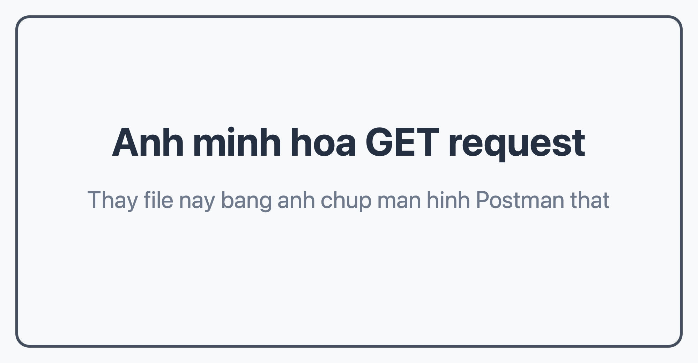
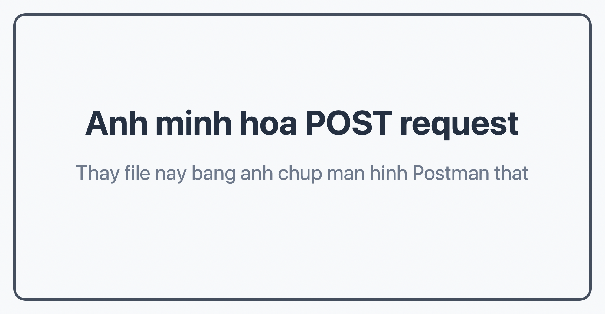
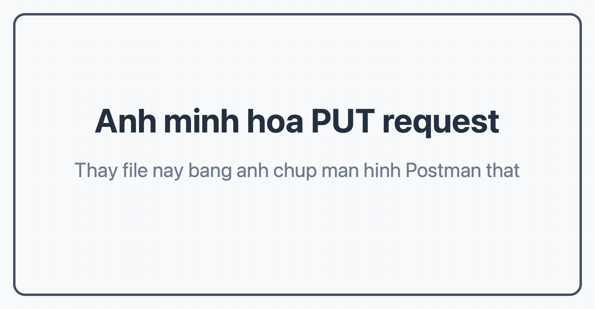
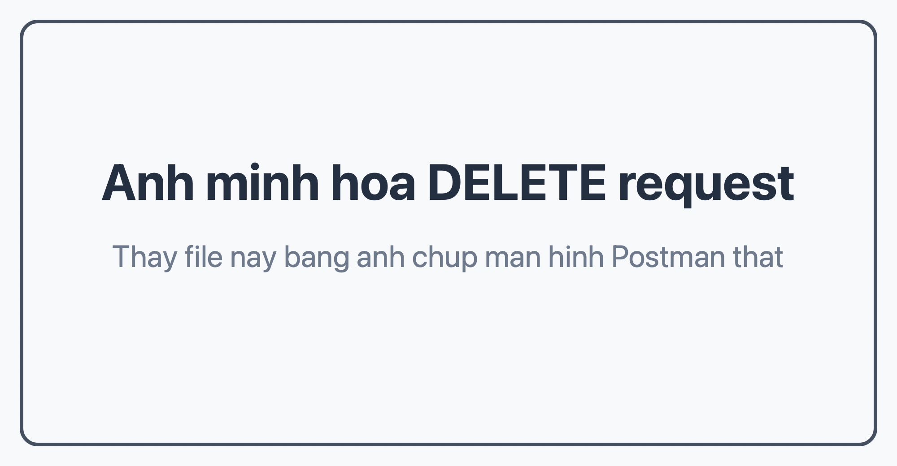

# BÁO CÁO THỰC HÀNH KIỂM THỬ API BẰNG POSTMAN

## 1. Giới thiệu công cụ Postman

Postman là một công cụ dùng để kiểm thử, gửi yêu cầu và quan sát phản hồi của API. Với Postman, người dùng có thể thực hiện các phương thức HTTP như `GET`, `POST`, `PUT`, `DELETE`, kiểm tra mã trạng thái, dữ liệu trả về, header và body của request.

Postman thường được sử dụng trong quá trình phát triển phần mềm để kiểm tra API trước khi tích hợp vào ứng dụng. Công cụ này có giao diện dễ sử dụng, hỗ trợ lưu request theo collection và có thể import/export để chia sẻ với người khác.

## 2. Mục tiêu bài thực hành

Bài thực hành này nhằm giúp sinh viên:

- Hiểu cách sử dụng Postman để kiểm thử API.
- Biết cách gửi các request HTTP cơ bản.
- Kiểm tra phản hồi trả về từ server.
- Làm quen với việc dùng dữ liệu JSON trong request body.
- Tạo và import collection Postman.
- Biết cách trình bày báo cáo thực hành và nộp lên GitHub.

## 3. Công cụ sử dụng

- Postman Web hoặc Postman Desktop.
- Trình duyệt web.
- GitHub để lưu trữ và nộp bài.
- API mẫu: JSONPlaceholder.

JSONPlaceholder là một API miễn phí dùng để thử nghiệm và học tập. API này hỗ trợ các request như lấy danh sách bài viết, thêm bài viết, cập nhật bài viết và xóa bài viết.

## 4. Các API test mẫu dùng JSONPlaceholder

Trong bài thực hành, sử dụng các API sau:

| Phương thức | URL | Chức năng |
| --- | --- | --- |
| GET | `https://jsonplaceholder.typicode.com/posts` | Lấy danh sách bài viết |
| POST | `https://jsonplaceholder.typicode.com/posts` | Tạo bài viết mới |
| PUT | `https://jsonplaceholder.typicode.com/posts/1` | Cập nhật bài viết có id là 1 |
| DELETE | `https://jsonplaceholder.typicode.com/posts/1` | Xóa bài viết có id là 1 |

## 5. Hướng dẫn import collection vào Postman Web

Các bước import file `postman_collection.json` vào Postman Web:

1. Truy cập trang web: `https://web.postman.co/`.
2. Đăng nhập hoặc tạo tài khoản Postman nếu chưa có.
3. Chọn workspace muốn sử dụng.
4. Nhấn nút **Import**.
5. Chọn tab **Files**.
6. Tải lên file `postman_collection.json` trong project này.
7. Nhấn **Import** để hoàn tất.
8. Mở collection `Postman Practice - JSONPlaceholder` và chạy từng request.

## 6. Kiểm thử phương thức GET

### 6.1. Mục đích

Request `GET` dùng để lấy danh sách bài viết từ API JSONPlaceholder.

### 6.2. Cách thực hiện

- Chọn phương thức: `GET`.
- Nhập URL:

```text
https://jsonplaceholder.typicode.com/posts
```

- Không cần nhập body.
- Nhấn nút **Send** trong Postman.

### 6.3. Kết quả mong đợi

- Status code trả về: `200 OK`.
- Response body là danh sách các bài viết ở dạng JSON.
- Mỗi bài viết có các trường như `userId`, `id`, `title`, `body`.

### 6.4. Ảnh minh họa

Chèn ảnh chụp màn hình kết quả request GET tại đây:



## 7. Kiểm thử phương thức POST

### 7.1. Mục đích

Request `POST` dùng để tạo một bài viết mới trên API.

### 7.2. Cách thực hiện

- Chọn phương thức: `POST`.
- Nhập URL:

```text
https://jsonplaceholder.typicode.com/posts
```

- Chọn tab **Body**.
- Chọn kiểu **raw** và định dạng **JSON**.
- Nhập body JSON:

```json
{
  "title": "Bai viet thuc hanh Postman",
  "body": "Day la noi dung bai viet duoc tao bang request POST.",
  "userId": 1
}
```

- Nhấn nút **Send**.

### 7.3. Kết quả mong đợi

- Status code trả về: `201 Created`.
- Response body chứa dữ liệu bài viết vừa gửi.
- API trả về thêm trường `id` cho bài viết mới.

### 7.4. Ảnh minh họa

Chèn ảnh chụp màn hình kết quả request POST tại đây:



## 8. Kiểm thử phương thức PUT

### 8.1. Mục đích

Request `PUT` dùng để cập nhật toàn bộ thông tin của bài viết có `id = 1`.

### 8.2. Cách thực hiện

- Chọn phương thức: `PUT`.
- Nhập URL:

```text
https://jsonplaceholder.typicode.com/posts/1
```

- Chọn tab **Body**.
- Chọn kiểu **raw** và định dạng **JSON**.
- Nhập body JSON:

```json
{
  "id": 1,
  "title": "Cap nhat bai viet bang PUT",
  "body": "Noi dung bai viet da duoc cap nhat trong Postman.",
  "userId": 1
}
```

- Nhấn nút **Send**.

### 8.3. Kết quả mong đợi

- Status code trả về: `200 OK`.
- Response body chứa dữ liệu bài viết sau khi cập nhật.
- Các trường `title` và `body` thay đổi theo nội dung đã gửi.

### 8.4. Ảnh minh họa

Chèn ảnh chụp màn hình kết quả request PUT tại đây:



## 9. Kiểm thử phương thức DELETE

### 9.1. Mục đích

Request `DELETE` dùng để xóa bài viết có `id = 1`.

### 9.2. Cách thực hiện

- Chọn phương thức: `DELETE`.
- Nhập URL:

```text
https://jsonplaceholder.typicode.com/posts/1
```

- Không cần nhập body.
- Nhấn nút **Send**.

### 9.3. Kết quả mong đợi

- Status code trả về: `200 OK`.
- Response body thường là một object rỗng `{}`.
- Request được thực hiện thành công trên API giả lập.

### 9.4. Ảnh minh họa

Chèn ảnh chụp màn hình kết quả request DELETE tại đây:



## 10. Nhận xét

Qua bài thực hành, em đã hiểu cách dùng Postman để gửi request đến API và kiểm tra response trả về. Các phương thức HTTP cơ bản gồm `GET`, `POST`, `PUT`, `DELETE` có mục đích sử dụng khác nhau:

- `GET` dùng để lấy dữ liệu.
- `POST` dùng để tạo dữ liệu mới.
- `PUT` dùng để cập nhật dữ liệu.
- `DELETE` dùng để xóa dữ liệu.

Postman giúp quá trình kiểm thử API trở nên trực quan hơn vì có thể quan sát rõ status code, body, header và thời gian phản hồi.

## 11. Kết luận

Bài thực hành kiểm thử API bằng Postman giúp em nắm được quy trình kiểm thử API cơ bản. Thông qua API mẫu JSONPlaceholder, em đã thực hiện được 4 request thông dụng là `GET`, `POST`, `PUT`, `DELETE`.

Kết quả thực hành cho thấy Postman là công cụ hữu ích trong học tập và phát triển phần mềm, đặc biệt khi cần kiểm tra API trước khi xây dựng giao diện hoặc tích hợp vào hệ thống.


